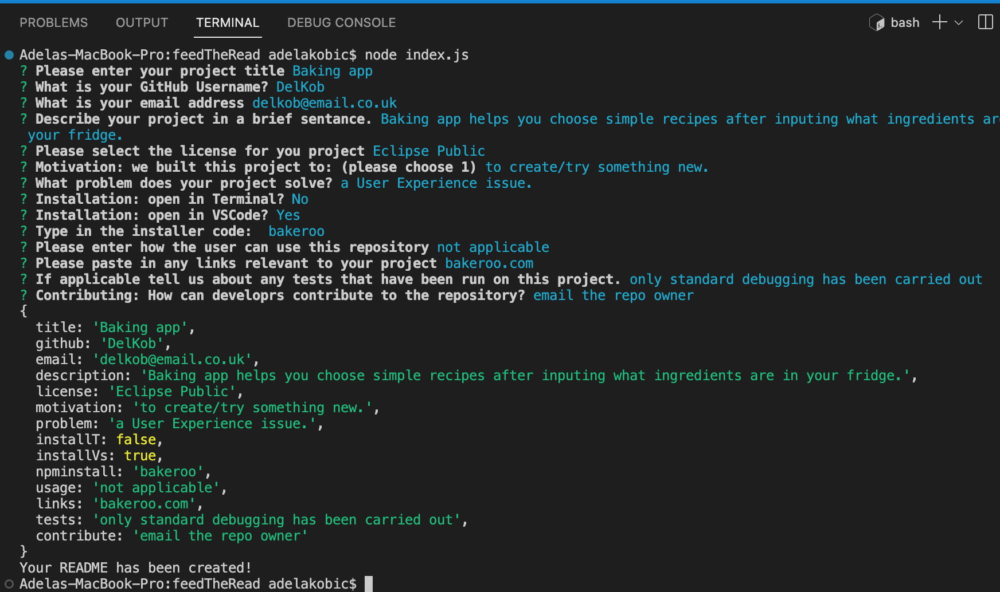

# feedTheRead 🥙😋🗒
This project is using Node.js to create a README generator. 

## Description 📜
When creating an open source project on GitHub, it’s important to include a high-quality README for the app. This should include what the app is for, how to use the app, how to install it, how to report issues, and how to make contributions&mdash;to increase the likelihood that other developers will contribute to the success of the project. 

This application will  quickly and easily create a README file by using a command-line application to generate one. This allows the project creator to devote more time to working on the project.

## Motivation 💪🏻
This app will help to generate a good quality README document so that developers can quickly create a professional README for a new project. 

## Build status 🏗
* The starter code has been built by the University of Birmingham and then additional code created by Adela Kobic.

## Code style 🔐
* Standard HTML, CSS and vanilla JavaScript and Node.js has been used for this project. 
The language for the website is written in US English. (USA English)

## Acceptance Criteria ✅
* GIVEN a command-line application that accepts user input
* WHEN I am prompted for information about my application repository
THEN a high-quality, professional README.md is generated with the title of my project and sections entitled Description, Table of Contents, Installation, Usage, License, Contributing, Tests, and Questions
* WHEN I enter my project title
THEN this is displayed as the title of the README
* WHEN I enter a description, installation instructions, usage information, contribution guidelines, and test instructions
THEN this information is added to the sections of the README entitled Description, Installation, Usage, Contributing, and Tests
* WHEN I choose a license for my application from a list of options
THEN a badge for that license is added near the top of the README and a notice is added to the section of the README entitled License that explains which license the application is covered under
* WHEN I enter my GitHub username
THEN this is added to the section of the README entitled Questions, with a link to my GitHub profile
* WHEN I enter my email address
THEN this is added to the section of the README entitled Questions, with instructions on how to reach me with additional questions
* WHEN I click on the links in the Table of Contents
THEN I am taken to the corresponding section of the README

## Assets 📷
Actual preview of FeedTheRead. 

## Problems encountered 🤯
* geting elements which are checkboxes to print to the ReadME, input elements work fine but the checkboxes aren't printing and also the list of licenses is comming up as undefined 28/8/22
* placeholders added but not working as yet 29/8/22 - placeholders added and working - not to self - it's 'default'
* license not displaying because it needs to have png on end of the link to make it an image - now working 1/9/22
* license link is deploying in README but no showing up in the Preview version - possible bug? 2/9/22

## Changes made to the code 𝌡
* created a ReadMe template into the gernerateMarkdown folder
* created code to go into the JS file asking the questions to generate the ReadMe file
* created the questions for the prompts 
* created the badge code for license - not working yet though
* badge displaying correctly
* table of contents created so you can scroll down to relevant section
* license links created but NOT yest tested 1/9/22
* new README generated and the license link is shoeing in the README but not in the Preview version 2/9/22

## Link to the Screencastify video 💻
Screencastify video via Google Docs: 

## Credits 💃🏻
* Picture credits as follows: 
    * No picture credits for this project. Standard emoji's used. 

## Licence 🪪
* No license for this project